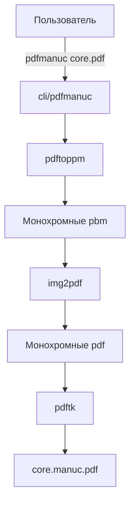

# Обзор архитектуры

## Структура проекта

```
.                                   # Корень проекта
├── cli                             # CLI-скрипты
├── docs                            # Документация
│   ├── Specs                       # Правила и спецификации
│   │   ├── Code                    # Правила написания кода
│   │   └── Task                    # Правил оформления задач
│   ├── Tasks                       # Задачи, ТЗ, планы, промпты, отчеты
│   └── pdf                         # Материалы по работе с pdf
│       └── examples                # Примеры исходных и сжатых pdf-файлов

```

## Модель БД


## Компоненты и их взаимодействие

### Схема взиимодействия компонентов 



### Описание компонентов

| Компонент | Назначение |
|---|---|
| `cli/pdfmanuc` | CLI-скрипт сжатия pdf-документов рукописных лекций |
| `pdftoppm` | Конвертация исходного pdf в набор монохромных pbm |
| `img2pdf` | Конвертация pbm в постраничные pdf |
| `pdftk` | Сборка постраничных pdf в единый pdf-файл |

## Модули компонента app


