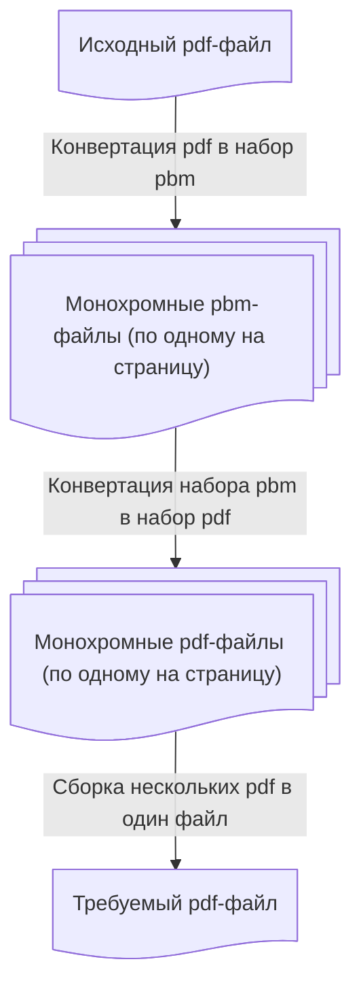

Создание cli скрипта для сжатия pdf-документа рукописных лекций
====================

# Контектст

Для использовании планшета для записи лекций встроенное ПО создаёт 
pdf файлы очень больших размеров. При том, что внутри черно-белые изображения
небольшой плотности (более 99% площади изображений - белый фон).

Есть необходимость в инструменте, который бы позволил получать из исходных 
файлов файлы кратно меньшего размера без существенной потери читаемости документа
с экрана планшета или компьютера

# Ручное решение



## Конвертация pdf в набор pbm

В консоли

```
pdftoppm -r 300 -mono core.pdf page
```

Получается набор файлов вида

```
$ ls -ahlGn
итого 19M
drwxrwxr-x 2 1000 4,0K сен 30 22:43 .
drwxrwxr-x 3 1000 4,0K сен 30 22:22 ..
-rw-rw-r-- 1 1000  14M сен 29 23:10 core.pdf
-rw-rw-r-- 1 1000 407K сен 30 22:43 page-01.pbm
-rw-rw-r-- 1 1000 407K сен 30 22:43 page-02.pbm
-rw-rw-r-- 1 1000 407K сен 30 22:43 page-03.pbm
-rw-rw-r-- 1 1000 407K сен 30 22:43 page-04.pbm
-rw-rw-r-- 1 1000 407K сен 30 22:43 page-05.pbm
-rw-rw-r-- 1 1000 407K сен 30 22:43 page-06.pbm
-rw-rw-r-- 1 1000 407K сен 30 22:43 page-07.pbm
-rw-rw-r-- 1 1000 407K сен 30 22:43 page-08.pbm
-rw-rw-r-- 1 1000 407K сен 30 22:43 page-09.pbm
-rw-rw-r-- 1 1000 407K сен 30 22:43 page-10.pbm
-rw-rw-r-- 1 1000 407K сен 30 22:43 page-11.pbm

```

## Конвертация набора pbm в набор pdf

В консоли для каждого файла `.pbm` выполнить

```
img2pdf page-01.pbm -o page-01.pdf
```

Получим набор файлов вида

```
$ ls -ahlGn
итого 19M
drwxrwxr-x 2 1000 4,0K сен 30 22:52 .
drwxrwxr-x 3 1000 4,0K сен 30 22:22 ..
-rw-rw-r-- 1 1000  14M сен 29 23:10 core.pdf
-rw-rw-r-- 1 1000 407K сен 30 22:43 page-01.pbm
-rw-rw-r-- 1 1000  13K сен 30 22:52 page-01.pdf
-rw-rw-r-- 1 1000 407K сен 30 22:43 page-02.pbm
-rw-rw-r-- 1 1000  16K сен 30 22:52 page-02.pdf
-rw-rw-r-- 1 1000 407K сен 30 22:43 page-03.pbm
-rw-rw-r-- 1 1000  15K сен 30 22:52 page-03.pdf
-rw-rw-r-- 1 1000 407K сен 30 22:43 page-04.pbm
-rw-rw-r-- 1 1000  13K сен 30 22:52 page-04.pdf
-rw-rw-r-- 1 1000 407K сен 30 22:43 page-05.pbm
-rw-rw-r-- 1 1000  14K сен 30 22:52 page-05.pdf
-rw-rw-r-- 1 1000 407K сен 30 22:43 page-06.pbm
-rw-rw-r-- 1 1000  15K сен 30 22:52 page-06.pdf
-rw-rw-r-- 1 1000 407K сен 30 22:43 page-07.pbm
-rw-rw-r-- 1 1000  13K сен 30 22:52 page-07.pdf
-rw-rw-r-- 1 1000 407K сен 30 22:43 page-08.pbm
-rw-rw-r-- 1 1000  19K сен 30 22:52 page-08.pdf
-rw-rw-r-- 1 1000 407K сен 30 22:43 page-09.pbm
-rw-rw-r-- 1 1000  19K сен 30 22:52 page-09.pdf
-rw-rw-r-- 1 1000 407K сен 30 22:43 page-10.pbm
-rw-rw-r-- 1 1000  16K сен 30 22:52 page-10.pdf
-rw-rw-r-- 1 1000 407K сен 30 22:43 page-11.pbm
-rw-rw-r-- 1 1000 7,3K сен 30 22:54 page-11.pdf
```

## Сборка нескольких pdf в один файл 

В консоли

```
pdftk \
    "page-01.pdf" \
    "page-02.pdf" \
    "page-03.pdf" \
    "page-04.pdf" \
    "page-05.pdf" \
    "page-06.pdf" \
    "page-07.pdf" \
    "page-08.pdf" \
    "page-09.pdf" \
    "page-10.pdf" \
    "page-11.pdf" \
    cat output \
"core.compressed.pdf"
```

Получается файл [`core.compressed.pdf`](../../docs/pdf/examples/core.compressed.pdf) размером `149К` 
вместо исходного [`core.pdf`](../../docs/pdf/examples/core.pdf) размером `14.2М`

## Удаление мусора

Очищаем каталог от промежуточных файлов

```
rm page-*
```

# Требуется

## Написать скрипт, автоматизирующий ручной способ конвертации

### Название скрипта

`pdfmanuc` - pdf manuscript compressor

### Минимальный запуск

```
pdfmanc core.pdf
```

Создаёт из файла `core.pdf` сжатый файл `code.manuc.pdf` и размещает его в том же 
каталоге, что и исходный. Исходный файл не удаляется

### Дополнительные аргументы командной строки

- `-h` , `--help` помощь по использованию
- `-o` файл, в который вывести результат, по умолчанию файл с таким
    же именем, но разрешением `.manuc.pdf` в том же каталоге 
- `-r` целевое разрешение изображений, по умолчанию `300`


### Расположение скрипта

В проекте скрипт разместить в каталоге cli в корне проекта.

### Дополнительные требования

1. Скрипт должен проверить наличие необходимого ПО и при отсутствии
    напечатать короткую справку об установке для различных 
    операционных систем из раздела "установка" корневого READMA.md

2. Скрипт должен размещать промежуточные файлы во временном каталоге, а после выполнения удалять их за собой.

## Написать README.md в корень проекта

На английском языке

### Раздел "О проекте"

### Раздел "Установка"

Где описать процесс установки, влючая
- клонирование репозитория
- установку необходимого для работы скрипта ПО для
    + Linux Ubuntu
    + Red Hat Linux
    + Arch Linux
- команду размещения скрипта в исполняемый каталог пользователя
- команду размещения скрипта в исполняемый каталог системы

### Раздел "Быстрый старт"

Где описать простейший пример использования

### Раздел "Расширенное использование"

Где описать работу всех атрибутов командной строки с примерами